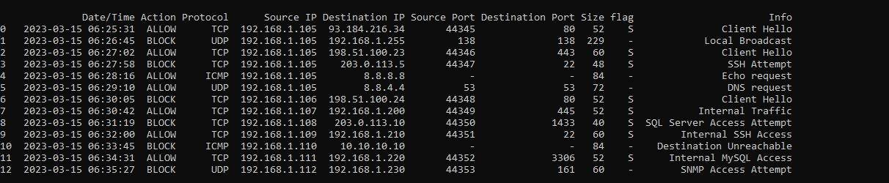
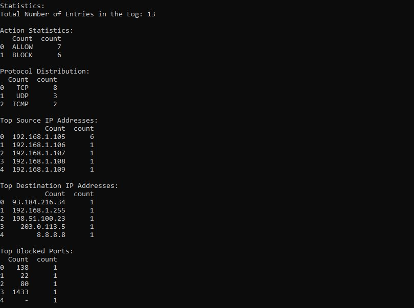

# Firewall Log Analyzer

A simple Python script for parsing and analyzing firewall log entries.

## Overview

This script takes user input for firewall log entries, parses them, and performs various statistics on the data.

## Features

- Parses firewall log entries into a structured DataFrame.
- Displays the entire log DataFrame.
- Calculates and displays statistics on:
  - Total number of log entries.
  - Action distribution.
  - Protocol distribution.
  - Top source and destination IP addresses.
  - Top blocked and allowed ports.
  - Additional statistic for Destination IP and Action combination.

## How to Use

1. Run the script.
2. Enter firewall log entries when prompted. Press Enter twice to finish.
3. View the entire parsed log DataFrame.
4. Review the calculated statistics.

## Requirements

- Python 3
- pandas library

## Usage

```bash
python app.py

## Screenshots

### Parsed Log DataFrame


### Statistics


